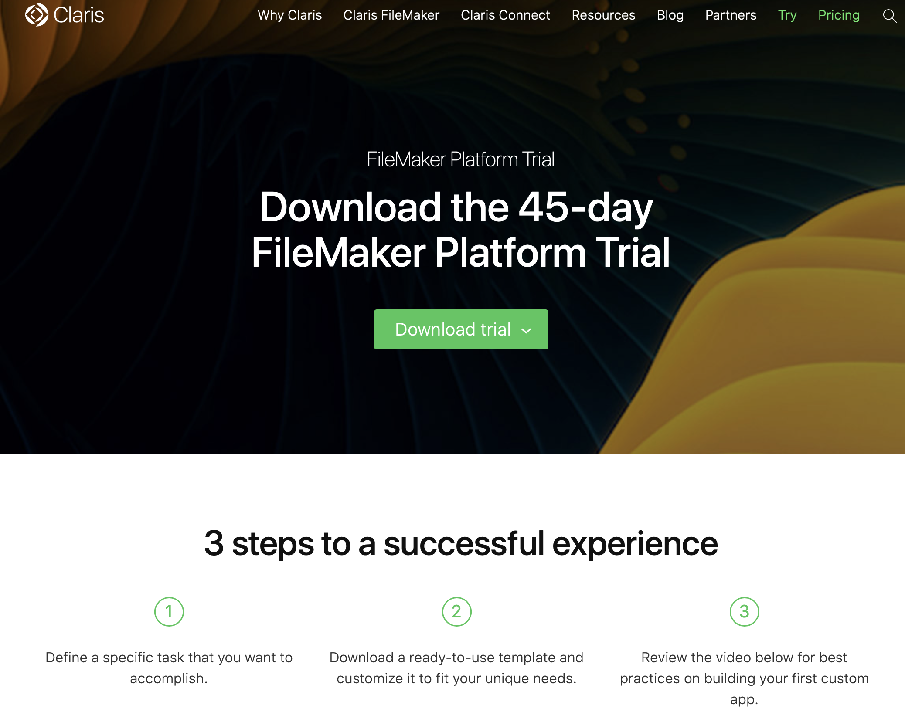

# Claris FileMaker - WebDirect | How to run your app right in your browser

> NOTE: This lab is done in an Apple envionrnment

### Learning objectives:
1. What is Claris FileMaker?
2. What is a WebDirect App?
3. Why should you care?

### What is Claris FileMaker?
- Claris FileMaker is a platform as a service model that allows you to create custom apps for mobile, cloud and on-perm environments. 
- You are able to share your app through FileMaker cloud or locally on FileMaker server.

### What is a WebDirect App?
- Web technology that runs FileMaker apps natively in a web browser.
- Client that allows users to access your web solutions. 

### Why should you care?
- Since the app runs in compatible web browsers - no intense web programming required!
- Flexibility and brand personalization.
- Easy to use security.
- integration with third-party software - SQL Server, IBM DB2, Oracle, and many more!

> For the purpose of this lab we’ll build a sample application to demonstrate how to use FileMaker
> Keep in mind you can host and use your already built application with FileMaker!

### So let’s start building our sample app:
## Step 1: Download FileMaker Pro - 45 days [FREE trial](https://www.claris.com/trial/)

## Step 2: Create a new Claris FileMaker file
- Open FileMaker Pro and click file > create new… > select BLANK document > Create
- Name the file Webtest > save
- Skip the next window by clicking OK for now

## Step 3: Define some basic security
- Security for programer and end-user side
- Click File > Manage > Security…
- A window displaying two default accounts should pop up - one [Guest] and one Admin account.
- Click the Admin account 
- Click the little pencil icon next to Password to set a new password > click Set Password 

> This Admin account will act as our *programmer*. The account we login with to do all the programming.  

## Step 3.2:  Create and configure WebDirect (client/end-user) account 
- On the same security window click +New and a new account should be created 
- Rename it to **Web**
- Give it a new password
- Select our new account and under Privilege Set change it from Read-Only Access to **Data Entry Only** > hit ok to exit the security window
- This will allow the account to add, delete and modify data 

> We’ll use this account to access our app as an and-user.

> If prompted login with our Admin credentials.
 
## Step 4: Make app shareable on FileMaker Server - allow our *program* account access to our app
- Click File > Sharing > Share with FileMaker Clients…
- A network settings window should popup
- Select our Webtest file > to the right select Specify users by privilege set > Specify… > select our Admin account

## Step 5: Make app shareable on WebDirect - allow our *end-user* account access to our app
- Click File > Sharing… > Configure for FileMaker WebDirect…
- Similar process as Step 4: Webtest file > to the right select Specify users by privilege set > Specify… 
- This time select Data Entry Only account > OK 

## Step 6: Upload the file to a FileMaker server - for end-user access
-  Close the file and click File > sharing > Upload to Host…
-  NOTE: We will be uploading our file to our local machine - we will have limited functionality to push it out to the greater internet internet  environment, but for testing purposes this will work fine.
- Click the + icon near the search bar and enter your host IP and name it Test
- If prompted, click Connect 

## Troubleshooting - unable to upload to host - connection failed error

## Read documentation [HERE](https://support.claris.com/s/article/Q-A-Uploading-files-to-FileMaker-Server-fails-or-files-upload-slowly-after-upgrading-Apache-Server-to-version-2-4-51?language=en_US)

